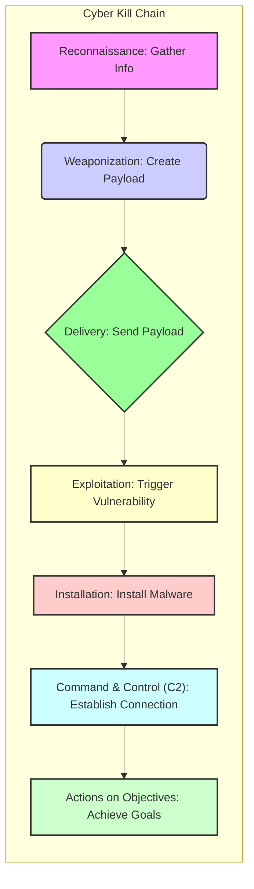
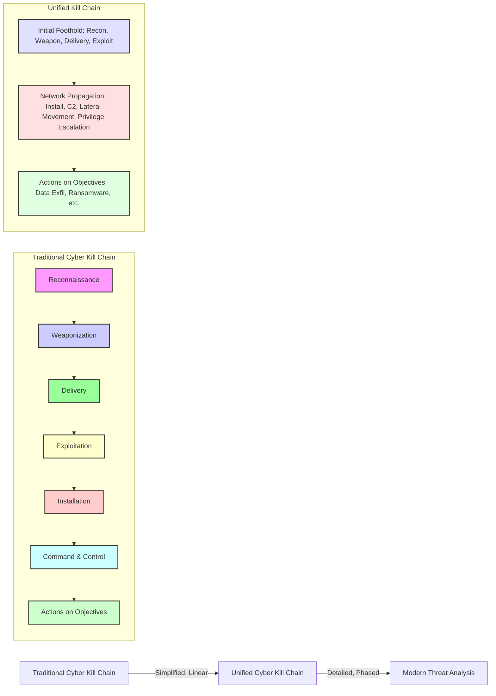

The Cyber Kill Chain is a framework used in cybersecurity to understand and combat cyberattacks. It breaks down the stages of a cyberattack, allowing security professionals to identify and disrupt those attacks at various points. Here's a breakdown of the key concepts:

**Origin and Purpose:**

* Developed by Lockheed Martin, the Cyber Kill Chain originated from a military concept of a "kill chain."
* It provides a structured approach to analyzing and countering cyber threats, particularly advanced persistent threats (APTs).
* The goal is to provide a model that allows security teams to interrupt and prevent cyberattacks.

**The Seven Stages:**

The original Lockheed Martin Cyber Kill Chain consists of seven stages:

* **Reconnaissance:**
    * The attacker gathers information about the target, identifying vulnerabilities and potential entry points.
* **Weaponization:**
    * The attacker creates a malicious payload, such as a virus or exploit, tailored to the identified vulnerabilities.
* **Delivery:**
    * The attacker delivers the weaponized payload to the target, often through methods like phishing emails, malicious websites, or infected USB drives.
* **Exploitation:**
    * The malicious payload exploits a vulnerability in the target's system or application.
* **Installation:**
    * The attacker installs malware on the compromised system, creating a backdoor for persistent access.
* **Command and Control (C2):**
    * The attacker establishes a communication channel with the compromised system, allowing them to remotely control it.
* **Actions on Objectives:**
    * The attacker takes actions to achieve their goals, such as data exfiltration, data destruction, or disruption of services.

**Key Concepts and Importance:**

* **Disruption:**
    * The Cyber Kill Chain emphasizes the importance of disrupting attacks at any stage. By understanding the stages, security teams can implement controls and defenses to prevent attacks from progressing.
* **Defense in Depth:**
    * The model supports a defense-in-depth strategy, where multiple layers of security are implemented to protect against attacks.
* **Threat Intelligence:**
    * Understanding the Cyber Kill Chain helps organizations to better utilize threat intelligence and identify patterns of attacker behavior.

**Variations and Adaptations:**

* While the original model has seven stages, some variations and adaptations exist, with some security professionals adding additional stages to account for evolving attack techniques.

In essence, the Cyber Kill Chain is a valuable tool for cybersecurity professionals to understand, analyze, and defend against cyberattacks.


The Cyber Kill Chain is a fundamental concept in cybersecurity, providing a structured way to understand and counteract cyberattacks. Here's a summary of its key aspects:

**Core Idea:**

* The Cyber Kill Chain, developed by Lockheed Martin, is a model that breaks down a cyberattack into distinct stages.
* This allows security professionals to analyze and disrupt attacks at various points in their progression.
* It's derived from the military concept of a "kill chain," adapted to the digital realm.

**Key Stages:**

The traditional Cyber Kill Chain consists of these seven stages:

* **Reconnaissance:**
    * The attacker gathers information about the target.
* **Weaponization:**
    * The attacker creates a malicious payload.
* **Delivery:**
    * The attacker delivers the payload to the target.
* **Exploitation:**
    * The payload exploits a vulnerability.
* **Installation:**
    * The attacker installs malware.
* **Command and Control (C2):**
    * The attacker establishes communication with the compromised system.
* **Actions on Objectives:**
    * The attacker achieves their goals (e.g., data theft).

**Importance:**

* **Defense Strategy:**
    * The Cyber Kill Chain helps organizations develop effective defense strategies.
* **Threat Analysis:**
    * It provides a framework for analyzing and understanding cyber threats.
* **Incident Response:**
    * It aids in incident response by providing a structured approach to containing and eradicating attacks.

**Key Considerations:**

* The Cyber Kill Chain is a valuable model, but it's important to recognize that cyberattacks can vary in complexity.
* Modern threats may involve variations or overlaps in the traditional stages.
* Security professionals are constantly adapting to evolving attack techniques.

In essence, the Cyber Kill Chain provides a valuable framework for understanding and combating cyberattacks, helping organizations to improve their overall security posture.


You've encountered a common issue with Mermaid syntax. The problem lies in the special characters within the node label `"Command & Control (C2): Establish Connection"`. Specifically, the ampersand (`&`) and parentheses `()` are causing the parser to stumble.

Here's how to fix it:

**1. Escape Special Characters:**

   * The most reliable way is to use quotation marks around the entire label.
   * Sometimes you will also need to escape the parenthesis with a backslash.

Here's the corrected code:



**Why this works:**

* By enclosing the entire label within double quotes `"..."`, you're telling Mermaid to treat the entire string as a single literal label, even if it contains special characters.

**Key takeaway:**

* When working with Mermaid, be mindful of special characters in your labels. Using quotation marks is a simple way to avoid parsing errors.


The "Unified Kill Chain" is an evolution of earlier cyber kill chain models, designed to address the complexities of modern cyberattacks, particularly advanced persistent threats (APTs). It aims to provide a more comprehensive and detailed view of an attacker's actions. Here's a breakdown of its key aspects:

**Why a Unified Approach?**

* Traditional kill chain models, while valuable, have limitations in dealing with the sophisticated tactics used in contemporary cyberattacks.
* The Unified Kill Chain seeks to integrate concepts from existing frameworks, such as the Lockheed Martin Cyber Kill Chain and the MITRE ATT&CK framework, to offer a more holistic perspective.

**Key Features:**

* **Enhanced Detail:**
    * It provides a more granular view of attack phases, incorporating specific tactics and techniques used by adversaries.
    * This allows for a deeper understanding of how attacks progress.
* **Broader Scope:**
    * It covers activities that occur both outside and inside the defended network.
    * This addresses the complexities of attacks that may involve various entry points and lateral movement.
* **Integration with MITRE ATT&CK:**
    * By integrating with the MITRE ATT&CK framework, it provides a knowledge base of adversary tactics, techniques, and procedures (TTPs).
    * This enables security professionals to better understand and defend against specific attack behaviors.
* **Phased Approach:**
    * The Unified Kill Chain generally divides an attack into three broad phases:
        * **Initial Foothold:** This phase includes techniques used to gain initial access to the target environment.
        * **Network Propagation:** Once initial access is established, attackers seek to move laterally within the network, escalate privileges, and access critical systems.
        * **Actions on Objectives:** In the final phase, attackers accomplish their goals, such as data exfiltration, sabotage, or deploying ransomware.

**Benefits:**

* **Improved Threat Detection:**
    * It enables organizations to identify patterns of attacker behavior and detect threats earlier in the attack lifecycle.
* **Enhanced Incident Response:**
    * It provides a structured approach to incident response, allowing security teams to effectively contain and eradicate attacks.
* **Stronger Security Posture:**
    * It helps organizations to develop more robust security strategies and defenses.

In essence, the Unified Kill Chain is a more advanced and detailed framework that enhances the ability of security professionals to understand, analyze, and defend against modern cyberattacks.




**Explanation of the Diagram:**

1.  **Traditional Cyber Kill Chain:**
    * This section represents the classic 7-stage model.
    * It's shown as a linear progression, emphasizing the sequential nature of those steps.

2.  **Unified Kill Chain:**
    * This section represents the more modern model.
    * It's divided into three broader phases:
        * **Initial Foothold:** This combines the early stages of reconnaissance, weaponization, delivery, and exploitation.
        * **Network Propagation:** This covers the stages of installation, command and control, lateral movement within the network, and privilege escalation.
        * **Actions on Objectives:** This encompasses the final goals of the attacker, such as data exfiltration or ransomware deployment.
    * It shows the grouping of the original steps into broader categories.

3.  **Comparison Arrows:**
    * The arrows connecting the two models illustrate the relationship between them.
    * "Simplified, Linear" indicates that the traditional model is a more straightforward representation.
    * "Detailed, Phased" indicates that the unified model provides a more nuanced and comprehensive view.
    * "Modern Threat Analysis" indicates that the unified model is better suited for analyzing today's sophisticated cyber threats.

4.  **Color Coding:**
    * The colors help to visually distinguish the different stages and models.

*mid
graph LR
    subgraph Backdoor Kill Chain
        A[Placement] --> B[Obfuscation] --> C[Activation] --> D[Persistence] --> E[Operations] --> F[Maintenance];
        F --> D;
    end

    subgraph Traditional Cyber Kill Chain
        G[Reconnaissance] --> H[Weaponization] --> I[Delivery] --> J[Exploitation] --> K[Installation] --> L[Command & Control] --> M[Actions on Objectives];
    end

    subgraph Unified Kill Chain
        N[Initial Foothold] --> O[Network Propagation] --> P[Actions on Objectives];
    end

    Q[Backdoor Kill Chain] -- Focus: Persistence --> R[Traditional/Unified Kill Chains]
    R -- Focus: Attack Lifecycle --> Q

    style A fill:#f9f,stroke:#333,stroke-width:2px
    style B fill:#ccf,stroke:#333,stroke-width:2px
    style C fill:#9f9,stroke:#333,stroke-width:2px
    style D fill:#ffc,stroke:#333,stroke-width:2px
    style E fill:#fcc,stroke:#333,stroke-width:2px
    style F fill:#cff,stroke:#333,stroke-width:2px

    style G fill:#e0e0ff,stroke:#333,stroke-width:2px
    style H fill:#ffe0e0,stroke:#333,stroke-width:2px
    style I fill:#e0ffe0,stroke:#333,stroke-width:2px
    style J fill:#e0e0ff,stroke:#333,stroke-width:2px
    style K fill:#ffe0e0,stroke:#333,stroke-width:2px
    style L fill:#e0ffe0,stroke:#333,stroke-width:2px
    style M fill:#e0e0ff,stroke:#333,stroke-width:2px

    style N fill:#e0e0ff,stroke:#333,stroke-width:2px
    style O fill:#ffe0e0,stroke:#333,stroke-width:2px
    style P fill:#e0ffe0,stroke:#333,stroke-width:2px
```

**Explanation of the Diagram:**

1.  **Backdoor Kill Chain:**
    * This section focuses on the specific stages related to establishing and maintaining a backdoor.
    * It emphasizes persistence, obfuscation, and ongoing operations.
    * The loop from "Maintenance" back to "Persistence" highlights the continuous effort to keep the backdoor active.

2.  **Traditional Cyber Kill Chain:**
    * This represents the classic 7-stage model, showing the broader attack lifecycle.

3.  **Unified Kill Chain:**
    * This represents the more modern, phased approach, providing a higher-level view of the attack.

4.  **Comparison Arrows:**
    * "Focus: Persistence" indicates that the backdoor kill chain is specifically concerned with maintaining access.
    * "Focus: Attack Lifecycle" indicates that the traditional and unified models provide a broader view of the entire attack.

5.  **Key Differences:**
    * The Backdoor Kill Chain is a sub section of the Installation, Command and control, and Actions on Objectives phases of the other kill chains.
    * The Backdoor kill chain, starts after the initial compromise has happened.
    * The Backdoor kill chain highlights the internal actions of an attacker after initial compromise.
    * The other kill chains highlight the external actions of an attacker leading up to and including compromise.

**Key Takeaways:**

* The Backdoor Kill Chain is a specialized model that focuses on the lifecycle of a backdoor, while the other models provide a more comprehensive view of the entire attack.
* Understanding the Backdoor Kill Chain is crucial for incident response and threat hunting, as it helps to identify and remove persistent threats.
Key Differences Highlighted:**

* The Unified Kill Chain emphasizes phases of activity, rather than strictly sequential steps.
* It incorporates lateral movement and privilege escalation, which are crucial aspects of modern attacks.
* It aligns more closely with frameworks like MITRE ATT&CK, providing more specific details on attacker tactics and techniques.
* The Unified Kill Chain is designed to reflect the reality of modern threat actors, who often use complex and overlapping techniques.


The "Backdoor Kill Chain" model, while not as formally defined as the traditional or unified kill chains, represents a specialized view of how attackers establish and maintain persistent access to a compromised system through backdoors. It focuses specifically on the lifecycle of a backdoor within a targeted environment.

Here's a breakdown of the typical stages in a backdoor kill chain:

**1. Initial Compromise (Outside the Backdoor Kill Chain):**

* This precedes the backdoor kill chain itself and represents the initial access gained by the attacker.
* It could involve any method, such as:
    * Exploiting vulnerabilities.
    * Phishing attacks.
    * Compromised credentials.

**2. Backdoor Placement:**

* The attacker installs the backdoor on the compromised system.
* This could involve:
    * Modifying system files.
    * Installing malicious software.
    * Creating hidden accounts.
* The goal is to create a persistent entry point that bypasses normal authentication and security controls.

**3. Backdoor Obfuscation:**

* The attacker attempts to hide the backdoor to prevent detection.
* This could involve:
    * Disguising the backdoor as legitimate system processes.
    * Encrypting or hiding malicious code.
    * Modifying timestamps or other system data.

**4. Backdoor Activation:**

* The attacker activates the backdoor to gain access to the system.
* This could be triggered:
    * Manually by the attacker.
    * Automatically based on a schedule or event.
    * Through a command and control server.

**5. Backdoor Persistence:**

* The attacker ensures that the backdoor remains active even if the system is restarted or security measures are updated.
* This could involve:
    * Creating scheduled tasks.
    * Modifying startup files.
    * Using rootkit techniques.

**6. Backdoor Operations:**

* The attacker uses the backdoor to perform malicious activities, such as:
    * Data exfiltration.
    * Lateral movement.
    * Privilege escalation.
    * Installing more malware.

**7. Backdoor Maintenance/Evolution:**

* The attacker maintains and updates the backdoor to ensure its continued functionality.
* This can include:
    * Patching vulnerabilities in the backdoor.
    * Changing communication protocols.
    * Adding new features.

**8. Backdoor Deactivation/Removal (Optional):**

* In some cases, the attacker may deactivate or remove the backdoor to avoid detection or cover their tracks.
* This is not always the case, as many backdoors are designed to remain persistent.

**Key Considerations:**

* The backdoor kill chain focuses on the specific actions related to backdoors, rather than the broader attack lifecycle.
* It highlights the importance of detecting and removing backdoors to prevent persistent access.
* This model is very useful when performing forensic analysis, and incident response.


Yes, you've hit upon a crucial distinction! The **cyclicity** and the **operational loop** are indeed significant differentiating factors between the Backdoor Kill Chain and the other models (Traditional and Unified).

Here's a breakdown of why:

* **Cyclicity/Operational Loop:**
    * The Backdoor Kill Chain emphasizes the ongoing, iterative nature of maintaining a backdoor.
    * The "Maintenance" stage, which loops back to "Persistence," highlights that attackers don't just establish a backdoor and leave it. They actively work to keep it functional, updated, and hidden.
    * This operational loop is designed to ensure long-term, persistent access.
    * This is very different from the other kill chains that are more linear in nature, and represent a progression.

* **Other Kill Chain Models (Traditional and Unified):**
    * These models primarily focus on the progression of an attack from initial reconnaissance to the final objectives.
    * They are more linear, describing the steps an attacker takes to gain access and achieve their goals.
    * While they acknowledge persistence (e.g., through Command and Control), they don't emphasize the continuous maintenance and evolution of a specific backdoor in the same way.

**In essence:**

* The Backdoor Kill Chain is about *sustaining* access, while the other models are about *gaining* access and achieving objectives.
* The backdoor kill chain happens after initial access has been gained.

Therefore, the cyclicity and the operational loop are key characteristics that set the Backdoor Kill Chain apart, making it a valuable tool for understanding and combating persistent threats.


It's difficult to pinpoint regulations that were completely "replaced" in a simple one-to-one fashion. Rather, cybersecurity regulations tend to evolve incrementally, building upon or expanding existing frameworks to address emerging threats. However, I can highlight some key areas where regulations have significantly strengthened and evolved:

**1. Data Privacy and Protection:**

* **Old:**
    * Early data protection laws often focused on specific sectors (e.g., healthcare with HIPAA, financial with GLBA) and were often limited in scope.
    * Many regulations lacked robust enforcement mechanisms or clear definitions of "personal data."
* **New/Evolved:**
    * **GDPR (General Data Protection Regulation):** This EU regulation set a global standard for data privacy, emphasizing individual rights, data minimization, and accountability. It has influenced similar laws worldwide.
    * **CCPA/CPRA (California Consumer Privacy Act/California Privacy Rights Act):** These California laws provide consumers with greater control over their personal data, including the right to know, delete, and opt-out of data sales.
    * These modern regulations emphasize:
        * Broader definitions of personal data.
        * Stronger enforcement powers.
        * Increased transparency and individual rights.
        * Data breach notification requirements.

**2. Cybersecurity Standards:**

* **Old:**
    * Early cybersecurity standards were often voluntary or sector-specific, leading to inconsistent security practices.
    * Many standards lacked detailed guidance on emerging threats and technologies.
* **New/Evolved:**
    * **NIST Cybersecurity Framework:** This framework provides a comprehensive set of guidelines for managing cybersecurity risks, emphasizing risk management and continuous improvement. It has become a widely adopted standard.
    * **ISO 27001:** This international standard provides a framework for establishing, implementing, maintaining, and continually improving an information security management system (ISMS).
    * Regulations are increasingly mandating adherence to these types of frameworks, providing greater consistency and accountability.
    * Increased focus on supply chain security.
    * Regulations are now beginning to focus on IOT security.

**3. Critical Infrastructure Protection:**

* **Old:**
    * Early regulations focused on physical security and lacked sufficient attention to cyber threats.
    * Information sharing between government and private sector was limited.
* **New/Evolved:**
    * Regulations are increasingly focusing on the cybersecurity of critical infrastructure sectors, such as energy, finance, and transportation.
    * Information sharing and collaboration between government and private sector are being emphasized.
    * Increased regulations on the reporting of cyber incidents.
    * Regulations are starting to focus on operational technology(OT) security.

**Key Trends:**

* **Shift from compliance to risk management:** Regulations are increasingly emphasizing a risk-based approach to cybersecurity, rather than simply checking boxes.
* **Increased focus on data governance:** Regulations are placing greater emphasis on how organizations collect, use, and protect data.
* **Greater international cooperation:** Cybersecurity is a global issue, and regulations are becoming increasingly harmonized across borders.

It's important to note that the regulatory landscape is constantly evolving, and organizations need to stay up-to-date on the latest requirements.


It's important to understand that there isn't a specific set of laws explicitly designed to "implement" the backdoor kill chain model. Rather, existing laws and legal frameworks are applied to address the various actions that occur within that model. Here's how legal regulations intersect with the concepts of backdoor creation and maintenance:

**Key Legal Areas and Their Relevance:**

* **Computer Fraud and Abuse Act (CFAA) (U.S.):**
    * This federal law prohibits unauthorized access to protected computer systems.
    * It directly applies to activities like:
        * Unauthorized installation of backdoors.
        * Exceeding authorized access to use a backdoor.
        * Damaging computer systems through backdoor operations.
    * This is a very important law when considering the legal ramifications of creating and using backdoors.
* **State Computer Crime Laws:**
    * Many states have their own computer crime laws that mirror or expand upon the CFAA.
    * These laws often address specific activities like:
        * Creating and distributing malware.
        * Unauthorized access to computer networks.
        * Data theft.
* **Data Breach Notification Laws:**
    * Laws like those in California (CCPA/CPRA) and others require organizations to notify individuals when their personal data has been compromised.
    * If a backdoor is used to exfiltrate data, these laws would come into play.
* **Intellectual Property Laws:**
    * If a backdoor is used to steal intellectual property, such as trade secrets or copyrighted material, intellectual property laws would be violated.
* **International Laws and Treaties:**
    * International treaties like the Budapest Convention on Cybercrime aim to harmonize cybercrime laws across countries.
    * These treaties address activities like:
        * Illegal access to computer systems.
        * Data interference.
        * System interference.

**How These Laws Relate to the Backdoor Kill Chain:**

* **Backdoor Placement:**
    * Laws like the CFAA and state computer crime laws prohibit the unauthorized installation of backdoors.
* **Backdoor Obfuscation:**
    * Attempts to hide backdoors may violate laws related to obstructing justice or tampering with evidence.
* **Backdoor Activation and Operations:**
    * Using a backdoor to steal data, damage systems, or conduct other malicious activities violates numerous laws, including those related to data theft, fraud, and vandalism.
* **Backdoor Maintenance:**
    * Continuing to maintain a backdoor to ensure persistent access can be considered ongoing unauthorized access, which is prohibited by law.

**Key Considerations:**

* The legal landscape is complex and constantly evolving.
* Enforcement of cybercrime laws can be challenging due to jurisdictional issues and the difficulty of attributing attacks.
* Organizations have a legal obligation to protect their systems and data from unauthorized access.

In essence, while there's no single "backdoor kill chain law," a combination of existing laws addresses the illegal activities that occur within that model.


When considering the Backdoor Kill Chain model in the context of intellectual property (IP) law, the key concern is how a backdoor can be used to steal, misuse, or infringe upon protected IP. Here's a breakdown of the relevant legal principles:

**1. Trade Secrets:**

* **Definition:** Trade secrets are confidential business information that provides a competitive edge. This could include formulas, designs, customer lists, or software algorithms.
* **Relevance to Backdoors:** Attackers might use backdoors to exfiltrate trade secrets from a compromised system.
* **Legal Protection:** The Defend Trade Secrets Act (DTSA) (U.S.) and state trade secret laws protect trade secrets from misappropriation.
* **Backdoor Impact:** If a backdoor is used to steal trade secrets, the attacker can be held liable for misappropriation under these laws.

**2. Copyright:**

* **Definition:** Copyright protects original works of authorship, such as software code, databases, and digital content.
* **Relevance to Backdoors:** Attackers might use backdoors to steal copyrighted software, databases, or other digital works.
* **Legal Protection:** Copyright law protects these works from unauthorized reproduction, distribution, and use.
* **Backdoor Impact:** If a backdoor is used to infringe on copyright, the attacker can be held liable for copyright infringement.

**3. Patents:**

* **Definition:** Patents protect inventions and discoveries.
* **Relevance to Backdoors:** While less direct, backdoors could be used to steal patent-protected designs or processes.
* **Legal Protection:** Patent law grants inventors exclusive rights to their inventions.
* **Backdoor Impact:** If a backdoor is used to steal information related to a patented invention, the attacker could be liable for patent infringement.

**4. Confidential Business Information:**

* **Definition:** This category encompasses a broader range of confidential information that may not meet the strict definition of a trade secret but is still commercially valuable.
* **Relevance to Backdoors:** Backdoors can be used to steal customer data, financial records, or other sensitive business information.
* **Legal Protection:** Contract law, non-disclosure agreements (NDAs), and other legal principles protect confidential business information.
* **Backdoor Impact:** If a backdoor is used to steal confidential business information, the attacker can be held liable for breach of contract or other legal violations.

**How the Backdoor Kill Chain Plays a Role:**

* **Exfiltration:** The "Backdoor Operations" stage of the Backdoor Kill Chain is where IP theft typically occurs. Attackers use the backdoor to exfiltrate sensitive data.
* **Persistence:** The "Backdoor Persistence" and "Backdoor Maintenance" stages ensure that attackers have continued access to steal IP over time.
* **Obfuscation:** The "Backdoor Obfuscation" stage helps attackers avoid detection while they steal IP.

**Key Legal Considerations:**

* The intent of the attacker is often a key factor in IP cases.
* Establishing evidence of IP theft can be challenging.
* Organizations should implement strong security measures to protect their IP from backdoor attacks.

In summary, the Backdoor Kill Chain model highlights how attackers can use backdoors to steal and misuse valuable IP, leading to legal violations under trade secret, copyright, patent, and contract law.

