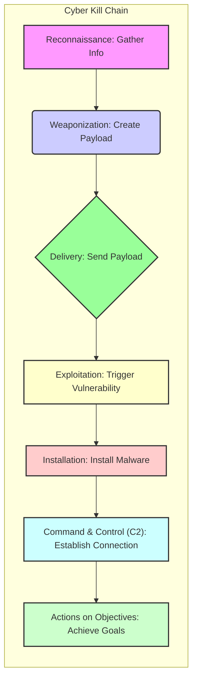

The Cyber Kill Chain is a framework used in cybersecurity to understand and combat cyberattacks. It breaks down the stages of a cyberattack, allowing security professionals to identify and disrupt those attacks at various points. Here's a breakdown of the key concepts:

**Origin and Purpose:**

* Developed by Lockheed Martin, the Cyber Kill Chain originated from a military concept of a "kill chain."
* It provides a structured approach to analyzing and countering cyber threats, particularly advanced persistent threats (APTs).
* The goal is to provide a model that allows security teams to interrupt and prevent cyberattacks.

**The Seven Stages:**

The original Lockheed Martin Cyber Kill Chain consists of seven stages:

* **Reconnaissance:**
    * The attacker gathers information about the target, identifying vulnerabilities and potential entry points.
* **Weaponization:**
    * The attacker creates a malicious payload, such as a virus or exploit, tailored to the identified vulnerabilities.
* **Delivery:**
    * The attacker delivers the weaponized payload to the target, often through methods like phishing emails, malicious websites, or infected USB drives.
* **Exploitation:**
    * The malicious payload exploits a vulnerability in the target's system or application.
* **Installation:**
    * The attacker installs malware on the compromised system, creating a backdoor for persistent access.
* **Command and Control (C2):**
    * The attacker establishes a communication channel with the compromised system, allowing them to remotely control it.
* **Actions on Objectives:**
    * The attacker takes actions to achieve their goals, such as data exfiltration, data destruction, or disruption of services.

**Key Concepts and Importance:**

* **Disruption:**
    * The Cyber Kill Chain emphasizes the importance of disrupting attacks at any stage. By understanding the stages, security teams can implement controls and defenses to prevent attacks from progressing.
* **Defense in Depth:**
    * The model supports a defense-in-depth strategy, where multiple layers of security are implemented to protect against attacks.
* **Threat Intelligence:**
    * Understanding the Cyber Kill Chain helps organizations to better utilize threat intelligence and identify patterns of attacker behavior.

**Variations and Adaptations:**

* While the original model has seven stages, some variations and adaptations exist, with some security professionals adding additional stages to account for evolving attack techniques.

In essence, the Cyber Kill Chain is a valuable tool for cybersecurity professionals to understand, analyze, and defend against cyberattacks.

The Cyber Kill Chain is a fundamental concept in cybersecurity, providing a structured way to understand and counteract cyberattacks. Here's a summary of its key aspects:

**Core Idea:**

* The Cyber Kill Chain, developed by Lockheed Martin, is a model that breaks down a cyberattack into distinct stages.
* This allows security professionals to analyze and disrupt attacks at various points in their progression.
* It's derived from the military concept of a "kill chain," adapted to the digital realm.

**Key Stages:**

The traditional Cyber Kill Chain consists of these seven stages:

* **Reconnaissance:**
    * The attacker gathers information about the target.
* **Weaponization:**
    * The attacker creates a malicious payload.
* **Delivery:**
    * The attacker delivers the payload to the target.
* **Exploitation:**
    * The payload exploits a vulnerability.
* **Installation:**
    * The attacker installs malware.
* **Command and Control (C2):**
    * The attacker establishes communication with the compromised system.
* **Actions on Objectives:**
    * The attacker achieves their goals (e.g., data theft).

**Importance:**

* **Defense Strategy:**
    * The Cyber Kill Chain helps organizations develop effective defense strategies.
* **Threat Analysis:**
    * It provides a framework for analyzing and understanding cyber threats.
* **Incident Response:**
    * It aids in incident response by providing a structured approach to containing and eradicating attacks.

**Key Considerations:**

* The Cyber Kill Chain is a valuable model, but it's important to recognize that cyberattacks can vary in complexity.
* Modern threats may involve variations or overlaps in the traditional stages.
* Security professionals are constantly adapting to evolving attack techniques.

In essence, the Cyber Kill Chain provides a valuable framework for understanding and combating cyberattacks, helping organizations to improve their overall security posture.

You've encountered a common issue with Mermaid syntax. The problem lies in the special characters within the node label `"Command & Control (C2): Establish Connection"`. Specifically, the ampersand (`&`) and parentheses `()` are causing the parser to stumble.

Here's how to fix it:

**1. Escape Special Characters:**

   * The most reliable way is to use quotation marks around the entire label.
   * Sometimes you will also need to escape the parenthesis with a backslash.

Here's the corrected code:

**Why this works:**

* By enclosing the entire label within double quotes `"..."`, you're telling Mermaid to treat the entire string as a single literal label, even if it contains special characters.

**Key takeaway:**

* When working with Mermaid, be mindful of special characters in your labels. Using quotation marks is a simple way to avoid parsing errors.

